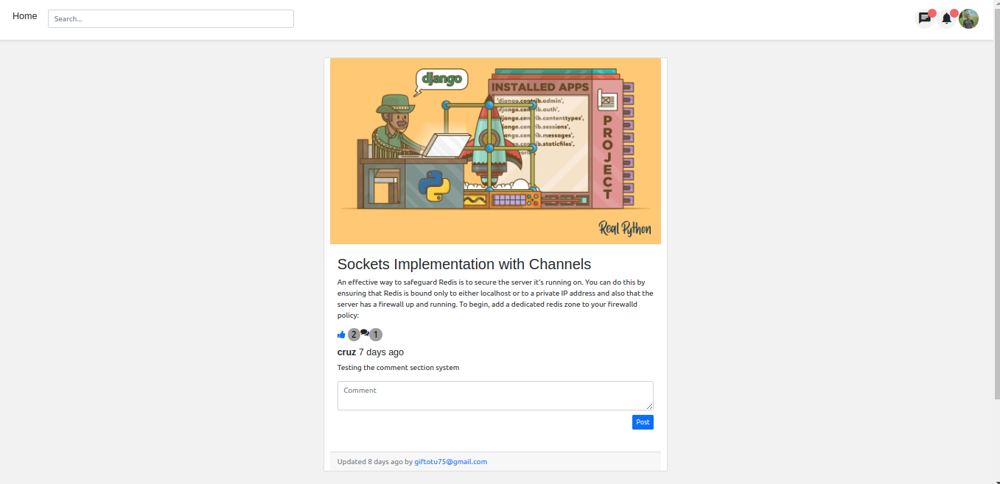
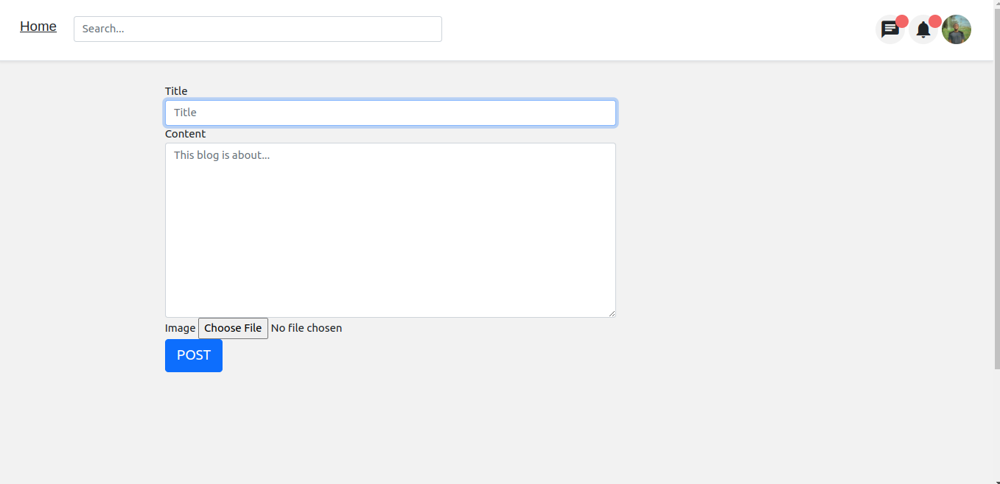
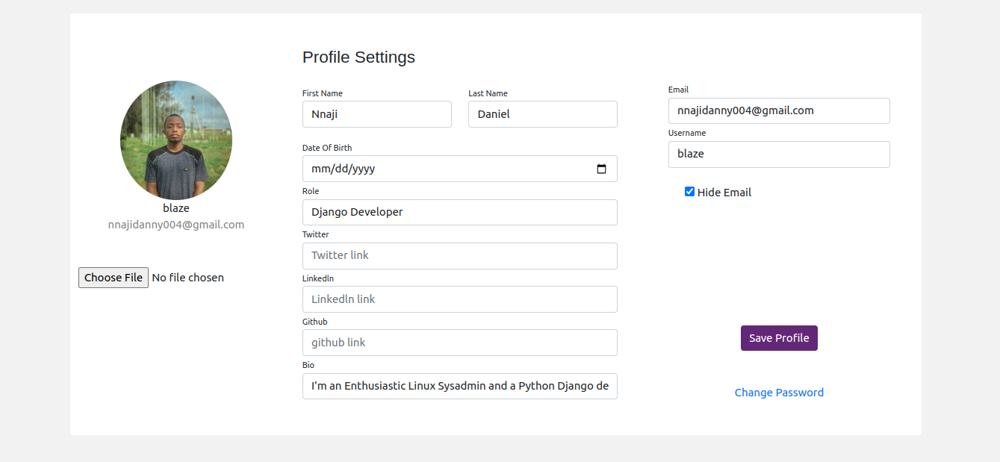

# social-media-blog
An advanced Social Media Blog app with Django

This social media blog app with Django has the following features:

- User Authentication: Users can create an account and login to access the blog functionality.

- Blog Posts: Users can create and publish blog posts with rich text editing capabilities.

- Commenting System: Users can leave comments on blog posts and interact with other users.

- Search Functionality: Users can search for blog posts based on keywords, tags, or categories.

- User Profiles: Users have personal profiles that display their information, activity, and published blog posts.

- friends system: Users can become friends with other users and receive updates on their activity.

- Chat_messaging system: Users can chat with their friends

- Rest Api support: An awesome django-rest api backend to support mobile applications.

- Notifications: Users receive notifications when their blog posts receive comments or when they are mentioned in other posts.(still in development)

- Admin Controls: Admins have the ability to manage users, moderate comments, and perform other administrative tasks.

In addition to the core features, this advanced social media blog with Django also includes features such as personalized content recommendations, integration with third-party APIs, and advanced analytics and reporting capabilities.

Overall, this advanced social media blog with Django provides a robust platform for bloggers to publish content and engage with their audience, while also providing opportunities for social interaction and user-generated content.

## Technologies Used

- Django
- PostgreSQL
- JavaScript
- Bootstrap
- Redis
- Django-channels
- Rest Api
- HTML/CSS

